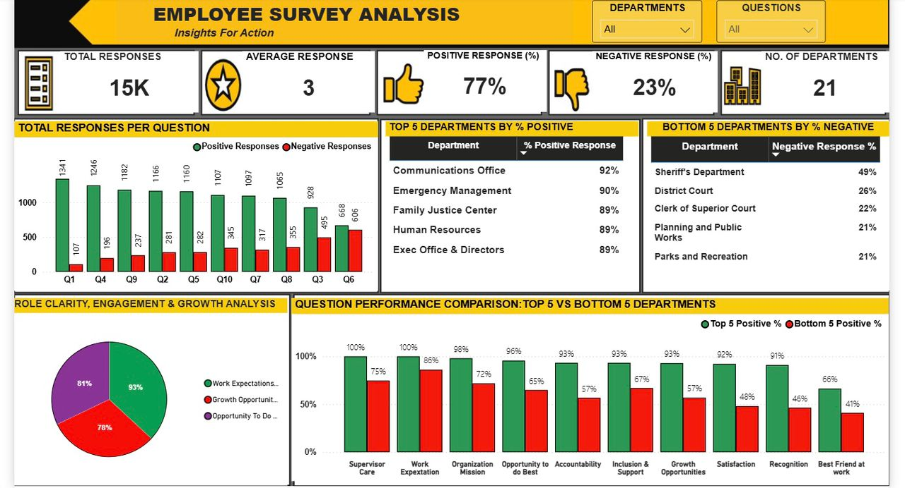
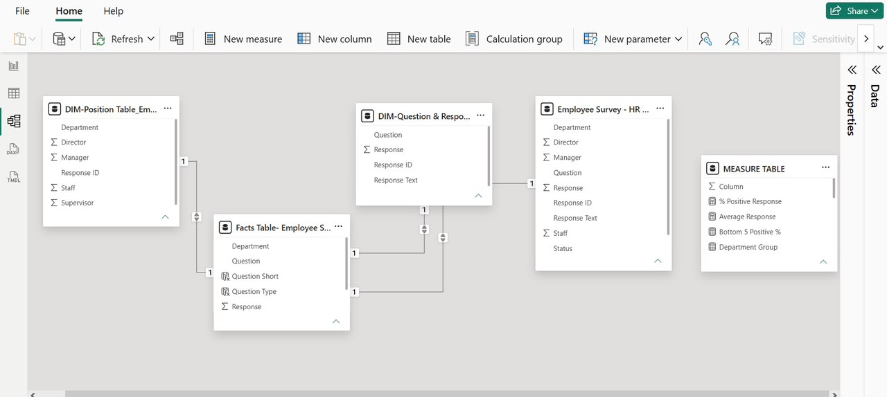

# 👥 Employee Survey Analysis



---

## Project Overview

#### This project analyzes employee engagement survey responses collected across 21 departments within Pierce County, Washington, to evaluate employee sentiment, departmental performance, workplace engagement, and organizational satisfaction.

---

## Problem

#### Organizations need to understand employee perceptions to identify strengths, address workplace challenges, and improve employee engagement, satisfaction, and overall organizational performance.

---

## Objectives

- Analyze overall employee engagement.
- Measure positive and negative employee sentiment.
- Compare responses across survey questions.
- Identify the highest performing departments.
- Identify the lowest performing departments.
- Compare employee experiences between top and bottom performing departments.
- Evaluate key workplace engagement factors.
- Develop an interactive Power BI dashboard for data exploration.

---

## Tools Used

- Microsoft Power BI
- Power Query
- DAX
- Microsoft Excel

---

## Dataset

#### Employee engagement survey responses collected across 21 departments within Pierce County, Washington, including department, position, survey question, response value, and response description.

---

## Data Cleaning

- Removed duplicate records
- Handled missing values
- Standardized response categories
- Created sentiment classifications
- Standardized question names
- Corrected data types

---

## Data Model

#### A star schema was created to improve performance and simplify analysis.



---

## Dashboard

#### The interactive Power BI dashboard provides insights into employee engagement, departmental performance, survey responses, and workplace satisfaction to support data driven decision making and organizational improvement.

## Dashboard KPIs

- Total Survey Responses
- Average Response Score
- Positive Response Rate
- Negative Response Rate
- Number of Departments
- Top 5 Departments by Positive Response Rate
- Bottom 5 Departments by Negative Response Rate


---

## Key Insights

- The organization recorded a 77% positive response rate, indicating generally favorable employee sentiment.
- Work Expectations received the highest positive responses.
- Recognition, Growth Opportunities, and Job Satisfaction recorded comparatively lower agreement levels.
- The Communications Office achieved the highest positive response rate, while the Sheriff's Department recorded the highest negative response rate.

---

## Recommendations

- Strengthen employee recognition programs.
- Expand professional development opportunities.
- Improve leadership practices within lower performing departments.
- Encourage regular employee feedback.
- Adopt best practices from high performing departments.
- Continue monitoring employee engagement through periodic surveys.

---

## Repository Structure

```

# Employee-Survey-Analysis/

# ├── Dashboard/

# │   └── Dashboard/Amanda Jubin-Fofie_Employee Survey.pbix

# ├── Data/

# │   └── Data/Employee Survey - HR Survey Reponses.csv

# ├── Images/

# │   ├── 

# │   ├── 

# ├── Report/

# │   └── Report/Amanda Jubin-Fofie_ Employee-Survey.pdf

# └── README.md

```

---

## Author

**Amanda Jubin-Fofie**

### Registered Clinical Dietitian | Aspiring Healthcare Data Analyst

### Power BI • SQL • Excel • Data Analytics

